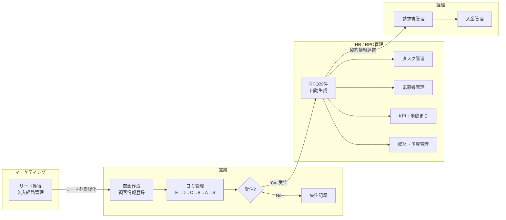
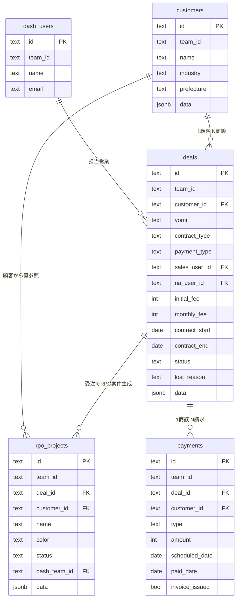
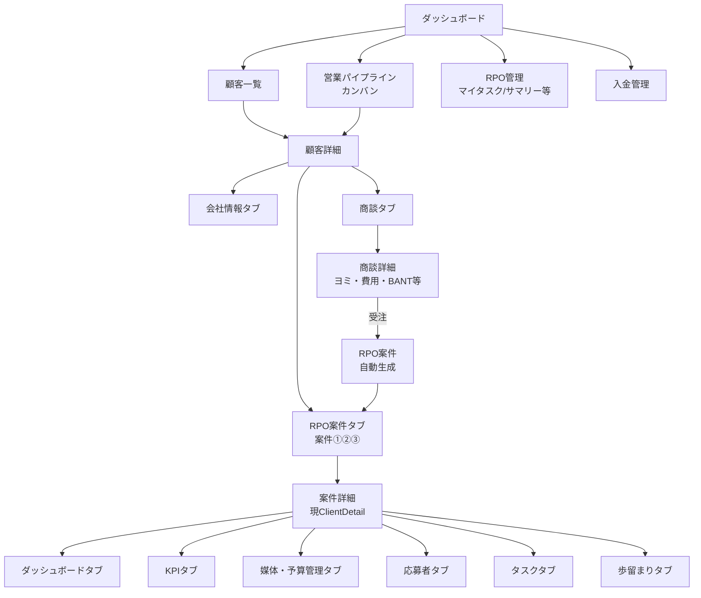
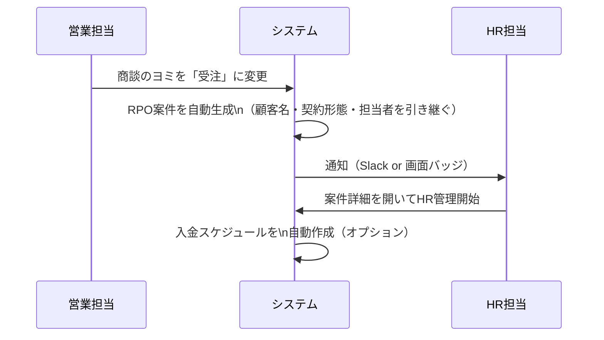

# システム設計図

## 1. 部署別業務フロー



---

## 2. データ構造（ER図）



---

## 3. 画面構成

```
新システム
├── ダッシュボード（既存）
│
├── 顧客管理（新規）
│   ├── 顧客一覧
│   │   ├── 会社名・業界・担当営業・最新ヨミ・案件数
│   │   └── 新規顧客追加
│   └── 顧客詳細
│       ├── 会社情報タブ（基本情報・担当者）
│       ├── 商談タブ（ヨミ一覧・商談詳細）
│       └── RPO案件タブ（案件①②③ をタブ切替）
│           └── ← 現在の ClientDetail がここに入る
│
├── 営業パイプライン（新規）
│   ├── カンバン形式（ヨミ別カラム）
│   └── 一覧表示
│
├── RPO管理（既存を統合）
│   ├── マイタスク
│   ├── サマリー
│   ├── 業務ガント
│   └── ワークロード
│
└── 入金管理（新規）
    ├── 請求一覧
    └── 入金状況
```

---

## 4. 画面遷移図



---

## 5. 受注→RPO案件生成フロー



---

## 6. 移行方針（既存データ）

| 現在 | 移行後 |
|---|---|
| `rpo_clients` 1件 | `customers` 1件 + `rpo_projects` 1件 |
| `rpo_clients.data.projectInfo` | `deals` テーブルに分離 |
| 担当者（文字列） | `dash_users` のIDに紐付け |
| kintone同期 | 移行後は廃止 / 手動移行 |

---

## 7. 実装フェーズ案

| フェーズ | 内容 | 優先度 |
|---|---|---|
| Phase 1 | 顧客マスタ + 商談管理 + ヨミ管理 | 🔴 高 |
| Phase 2 | 受注→RPO案件自動生成 + 既存RPO統合 | 🔴 高 |
| Phase 3 | 入金管理 | 🟡 中 |
| Phase 4 | リード管理（App94相当） | 🟢 低 |
| Phase 5 | kintoneからのデータ移行スクリプト | 🟡 中 |
